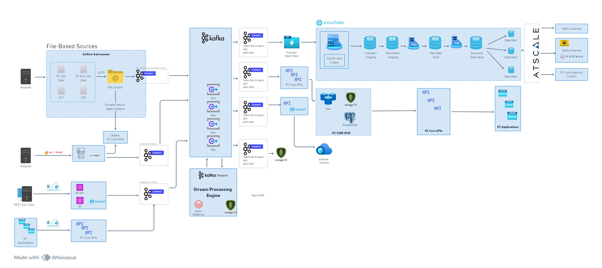

# Healthcare-RCM-Pipeline

## Overview
The **Healthcare-RCM-Pipeline** is a scalable data pipeline designed for **Healthcare Revenue Cycle Management (RCM)**, with a focus on **claims processing and denials management**. This project begins with **file-based batch processing (MVP)** and will evolve into a real-time **HL7 and EDI API-driven system** using **Kafka, Spark, and Airflow**.

## Architecture Diagram


## Features
- ✅ **MVP (Phase 1):** Batch processing for **EDI 837 (Claims), EDI 835 (Denials), Retro, Invoice, and Cross Files**.
- 🔄 **Phase 2:** Integration of **HL7 interfaces & APIs** for real-time ingestion.
- 🚀 **Phase 3:** Full **event-driven automation** for claims submissions & denials resubmission.
- 📊 **Data Storage:** Supports **Snowflake, PostgreSQL, and NoSQL Databases**.
- 📈 **Monitoring & Analytics:** **Grafana, Prometheus, and R1 Hub Analytics (SSRS)**.
- 🤖 **Machine Learning (Optional):** Predict **denial risks & automate claim corrections**.

## Tech Stack
| Category               | Tools & Technologies |
|-----------------------|----------------------|
| **Data Ingestion**   | Kafka, REST API, SFTP |
| **Processing & ETL**  | Apache Spark, PySpark, Airflow, Pandas |
| **Storage & Querying**| Snowflake, PostgreSQL, NoSQL (MongoDB) |
| **Machine Learning**  | MLflow, AWS SageMaker (Optional) |
| **Monitoring & Alerts** | Prometheus, Grafana, SSRS |

## Repository Structure
```
📂 Healthcare-RCM-Pipeline
│── 📂 ingestion           # Data ingestion (File-based, API, Streaming)
│── 📂 processing          # Airflow DAGs, Spark transformations
│── 📂 storage             # SQL scripts, data loaders
│── 📂 analytics           # SQL queries, dashboards
│── 📂 ml_model (Optional) # Denial risk prediction model
│── 📂 api                 # Claim submission & resubmission APIs
│── 📂 data_samples        # Sample EDI 837, 835 files
│── README.md              # Documentation
│── requirements.txt       # Dependencies
│── .gitignore             # Ignore unnecessary files
```

## Getting Started
### Prerequisites
- Python 3.8+
- Kafka
- Apache Airflow
- Apache Spark
- PostgreSQL / Snowflake
- AWS S3 (Optional)

### Installation
1. Clone the repository:
   ```bash
   cd Healthcare-RCM-Pipeline
   git clone https://github.com/ishi3012/healthcare-rcm-pipeline.git
   ```
2. Install dependencies:
   ```bash
   pip install -r requirements.txt
   ```
3. Set up Airflow and Kafka:
   ```bash
   docker-compose up
   ```

## Contribution Guidelines
We welcome contributions! Please open an issue or submit a pull request with any improvements or feature additions.

## License
This project is licensed under the MIT License.

---
💡 **Future Enhancements:** Integration of real-time analytics, automated claim correction workflows, and predictive modeling for **denials reduction**.

